What is FIS-B Decode?
=====================

**FIS-B Decode** ('fisb-decode') is a back-end system for processing FIS-B
(Flight Information System - Broadcast)
messages transmitted on 978 Mhz, mostly in the United States.
FIS-B
primarily contains meteorological information to be used in flight.
This implementation roughly follows the DO-358B standard.

'fisb-decode' is composed of two main parts:

* The capture part of the system ('fisb') is a good way to explore the internal
  structures of FIS-B and can be used as a stand-alone system for this
  purpose. 'fisb' is a multi-level system that turns binary FIS-B messages
  into fully independent weather messages.
* The database part of the system ('harvest') creates .png images,
  turns vector data into geoJSON, and manages the FIS-B message base using
  MongoDB.

'fisb-decode' is strictly a back-end 'meat and potatoes' system.
It does not provide a web-based
interface for humans. It is certainly possible to create front-end systems
using fisb-decode, but fisb-decode is not that system.

FIS-B Decode is not designed, nor intended,
to be used for any purpose other than fun exploration. 

.. warning::
   FIS-B Decode is **NOT** intended for actual flight use, nor to be used
   as a component of a system for any flight related operations
   (flight planning, etc). It is strictly a fun hobby program with
   many bugs. It is based loosely on draft standards, not actual 
   standards, and has not undergone any formal testing. **DO NOT
   USE OTHER THAN FOR FUN-- NOT FLIGHT!!**

Getting things running
======================

All the comments that follow assume you are using Ubuntu Linux version
20.04. You can, of course, use other systems, but you will need to
adapt these instructions to fit them.

After putting the repository where you want it, the first thing is to
add a path to the Python code by using ``PYTHONPATH``.
Create ``PYTHONPATH`` or add to it if it already
exists. The best way to do this is at shell startup time by adding
the lines: ::

  PYTHONPATH=~/fisb-decode
  export PYTHONPATH

to your ``.bashrc`` in your home directory. This is assuming you cloned
'``fisb-decode``' into your home directory. Change the path as needed to
match your installation.

dump978-fa Setup
----------------

Unrelated to fisb-decode is
`FlightAware's 978 <https://github.com/flightaware/dump978>`_.
This is the program you should use to capture FIS-B packets from
a radio for concurrent or later processing. There are other dump978
programs out there, but ``dump978-fa`` provides an arrival timestamp
which is critical for fisb-decode. Read their instructions to get your
radio working with ``dump978-fa``.

For the initial setup, we will be using some already captured data, but
at some point you will want to use your own live or recorded data. Live
data is best, but works only if you are close to an airport or tower.
To record data, bring a laptop with ``dump978-fa`` close to a tower or
airport base station.
Visit `http://towers.stratux.me <http://towers.stratux.me/>`_ for a
list of tower locations (this isn't guaranteed to be up to date, but is a good starting
point). Here you can get your basic radio setup working and debugged.

What you are looking for is lines from ``dump978-fa`` that look like: ::

 +38f18185534cbdc0058001001a4092ad19f8f8f8f8058001001a4093f26ef8f8f8f8058001
 001a40957526f8f8f8f8058001001a409231f4f8f8f8f8058001001a4093fb33f8f8f8f8058
 001001a4093fb38f8f8f8f8058001001a409231eff8f8f8f8058001001a409231f9f8f8f8f8
 058001001a4092ad32f8f8f8f8058001001a4095751cf8f8f8f8058001001a40923203f8f8f
 8f8058001001a4092ad37f8f8f8f8058001001a4092ad3cf8f8f8f8058001001a4092b5b1f8
 f8f8f8058001001a4092b5b6f8f8f8f8058001001a40940402f8f8f8f8058001001a409231f
 ef8f8f8f8058001001a40923208f8f8f8f8058001001a4092b5bbf8f8f8f8058001001a4092
 b5c0f8f8f8f8058001001a4092320df8f8f8f8058001001a4092b5c5f8f8f8f8058001001a4
 092b5caf8f8f8f8058001001a409551fef8f8f8f8058001001a40940cccf8f8f8f805800100
 1a409574f4f8f8f8f8058001001a4092b5cff8f8f8f8058001001a40923221f8f8f8f805800
 1001a40956c0cf8f8f8f8058001001a40923226f8f8f8f8058001001a40941596f8f8f8f805
 8001001a4092b5fcf8f8f8f80000000000000000;rs=43;rssi=-10.8;t=1595572682.219;

These are FIS-B packets. Depending on the type of station you are monitoring,
you will see one to four of these per second. FIS-B packets are preceded
with a '``+``'.

If instead, you see smaller, sporadic packets starting with '``-``': ::

  -0b28c90b386ab185446c0706013426407105c4e6c4e6c40a3a820300000000000000
  ;rs=43;rssi=-10.8;t=1595572682.219;

you are looking at aircraft sending UAT data. If this is all you are seeing,
it implies that your radio setup is working, but you are not near a FIS-B
ground station.

``dump978-fa`` doesn't work out of the box with all radios supported by
SoapySDR. I use a RSP1A and I needed to create a patch. The modulator
code can also benefit with a patch if you are, like me, using a beam
from 6 miles away to capture data. The ``fisb-decode/misc/dump978fa``
directory has these patches, as well as examples of the commands I
use to capture data.

Once you are getting solid FIS-B packet reception, try to save some in
a file for later processing. If you record an hours worth, you will have
at least one of everything they are sending. A little over an hour will
get you at least two sets of METARs. Most products are retransmitted, so
you should get most items in a 15 minute interval. More
data is always better, so collect as much as you can. Going during bad
weather times will get you a better regional radar display.

Initial fisb-decode decoding
----------------------------

For all the examples that follow, we will making extensive use of
fisb-decode configurations files. There are a lot of them: they are
well documented, but if they are not set up for what you are trying
to do, you will not get the expected result. The configuration files
are guaranteed to be set with random values each time the
repository is updated, so always check the values.

It is also assumed that all programs (except for a very few exceptions)
are to be run from the ``fisb-decode/bin`` directory. So always ``cd``
there before running anything. I often refer to this as the ``bin`` directory
in these instructions.
All the scripts use relative paths.

A general principle is that the main programs all write into an
error file if they run into problems. These error files will appear
in the directory you are running the program from (``fisb-decode/bin``).
So if you see an error file in the ``bin`` directory (like ``LEVEL0.ERR``),
something went wrong.
These programs will also *erase* their error file at the start of
execution. This is done so you can be assured that any errors occurred
in the latest run of the program.

There are two main parts to 'fisb-decode'. The basic decode (also called
'fisb') and 'harvest'. There are 4 levels (0-3) of basic message decoding ('fisb').
Level 0 takes its data from ``dump978-fa``. The other
layers take the output from the preceding layer.
The various levels do the following:

  0. Performs basic decoding. Turns the message into a JSON file, which
     for the most part is just a translation of the FIS-B message into
     JSON. No special translations are performed (for the most part).
     *If all you want to do is to see the basic message, you can stop
     here*. There are also configuration settings for seeing all the
     reserved bits of the message (i.e. the parts you're supposed to
     ignore).
  1. a) Processes level 0 segmented messages-- where a single FIS-B message
     can't hold an entire payload and the total
     message is sent as a number of single messages. Those messages are
     recombined back to a single large message.
     b) Also, many messages are really two
     part messages: one containing a text portion, and the other containing
     a graphics portion. These are called 'Text With Graphic Overlay (TWGO)'
     messages. Level 1 will process these messages according to the
     standard (more details later).
  2. Breaks apart the FIS-B message and makes a separate set of
     messages. So instead of a FIS-B 413 message type which groups all
     text-based weather reports as one, level 2 provides a message type
     for METARs, PIREPs, TAF, WINDs, etc. Another big part of level two
     is making sense of FAA times and dates. Most FAA products don't have
     complete timestamps. A lot of processing is performed to make sure
     that all dates are turned into complete ISO-8601 timestamps.
     Basically, level 2 gives you the message you *wish* FIS-B sent.
  3. Removes duplicate messages. FIS-B, by design, frequently sends out
     retransmitted messages. This level will block repeats and only send out
     unique messages in some cases. Level 3 doesn't change any message.
     It just helps to decrease the load on harvest. Because of the standard,
     the logic is somewhat complicated. See the level 3 source for more
     clarification.

'Harvest' takes the output of the above levels and stores the data in
a database. All data except images are stored in the database. Images
are stored in a directory. Harvest manages the database, adding new data
and expiring old data.

If all you are interested in is basic FIS-B message decoding, you won't
be needing anything fancier than 'fisb' level 0 or level 1. Lets start with
basic level 0 decoding.

Edit ``fisb-decode/fisb/level0/level0Config.py`` so that the following
lines match: ::

  SKIP_EMPTY_FRAMES = False
  DETAILED_MESSAGES = True
  BLOCK_SUA_MESSAGES = False
  ALLOW_SERVICE_STATUS = True
  ARCHIVE_MESSAGES = False  
  WRITE_MESSAGE_TO_FILE = False
  SHOW_MESSAGE_SOURCE = False
  CALCULATE_RSR = False
  DLAC_4BIT_HACK = False
  ALLOW_DECODE_TEST = False
  
Next you will install some python dependencies.
Install ``pip3`` if not already installed. On a ubuntu 20.04
system use: ::

  sudo apt install python3-pip

From the ``bin`` directory type: ::

  pip3 install -r ../misc/requirements-fisb.txt

Then type: ::

  cat ../tg/tg-source/generated/tg30.978 | ./decode0

``tg30.978`` is a local capture from my system that I use as a test group
(more on test groups later). It represents around 8 minutes of live data.
What you should see is a whole bunch of messages fly by. Each one looking
something like: ::

  {
   "rcvd_time": "2020-10-30T09:00:07.107Z",
   "app_data_valid": 1,
   "position_valid": 0,
   "station": "40.0383~-86.255593",
   "longitude": -86.255593,
   "latitude": 40.0383,
   "utc_coupled": 1,
   "transmission_time_slot": 11,
   "mso": 220,
   "mso_utc_ms": 61.0,
   "data_channel": 20,
   "tisb_site_id": "C",
   "tisb_site_id_type": "M1",
   "reserved_7_2": 0,
   "reserved_8_58": 0,
   "frames": [
    {
      "frame_type": 0,
      "product_id": 11,
      "agp_flag": 0,
      "frameheader_2_24": 0,
      "t_opt": 2,
      "month": 10,
      "day": 30,
      "hour": 8,
      "minute": 51,
      "s_flag": 0,
      "contents": {
        "record_format": 2,
        "location": "",
        "record_count": 1,
        "record_reference_point": 255,
        "product_version": 2,
        "reserved_2_58": 0,
        "records": [
          {
            "text_record_length": 240,
            "report_number": 10886,
            "report_year": 20,
            "report_status": 1,
            "reserved_5_78": 0,
            "text": "AIRMET KBOS 300851 BOSS WA 300845\nAIRMET SIERRA UPDT 1
	             FOR IFR AND MTN OBSCN VALID UNTIL 301500\nAIRMET MTN
		     OBSCN...ME NH VT MA NY PA WV MD VA NC SC GA\nFROM 60SE
		     YSC TO CON TO HAR TO 20WSW LYH TO 40WNW SPA TO ATL
		     TO\nGQO TO HMV TO HNN TO JHW TO 60SE YSC\nMTNS OBSC BY
		     CLDS/PCPN/BR/FG. CONDS CONTG BYD 15Z THRU 21Z.\n"
	    }
	  ]
	}
      }
    ]
  }

This is an example of a message that has all of its bits exposed.
If you are only interested in seeing how FIS-B messages are composed,
you can stop here.

Moving on to levels 1 and 2, let's update the config files.

Make ``../fisb/level1/level1Config.py`` match: ::
  
  READ_MESSAGES_FROM_FILE = False

Make ``../fisb/level2/level2Config.py`` match: ::
  
  BYPASS_TWGO_SMART_EXPIRATION = False

For level 1 decode type: ::

  cat ../tg/tg-source/generated/tg30.978 | ./decode1

The only difference level 1 makes is that any segmented messages are
grouped together and decoded. Also, TWGO (text with graphic overlay)
messages that have text and graphic sections will have them matched
up and sent. The standard dictates that the text part of TWGO messages
are immediately sent and the graphics portion is stored until it has
a matching text portion. When both parts are available, the graphics
part can be sent out with the text part.

Level 2 messages are a totally different animal.
We don't
need all the extra detail level 0 can give us for these, so we will turn
those features off.

Make ``../fisb/level0/level0Config.py`` match: ::

  SKIP_EMPTY_FRAMES = True  (changed)
  DETAILED_MESSAGES = False (changed)
  BLOCK_SUA_MESSAGES = False
  ALLOW_SERVICE_STATUS = True
  ARCHIVE_MESSAGES = False  
  WRITE_MESSAGE_TO_FILE = False
  SHOW_MESSAGE_SOURCE = False
  CALCULATE_RSR = False
  DLAC_4BIT_HACK = False
  ALLOW_DECODE_TEST = False
  
For level 2 decode type: ::

  cat ../tg/tg-source/generated/tg30.978 | ./decode2

You should see output that looks something like: ::

  {
   "type": "METAR",
   "unique_name": "KOCQ",
   "location": "KOCQ",
   "contents": "METAR KOCQ 140715Z AUTO 00000KT 10SM OVC120 03/02 A3025
    RMK AO1\n     T00310016=",
   "observation_time": "2021-05-14T07:15:00Z",
   "expiration_time": "2021-05-14T09:15:00Z"
  }
  {
   "type": "TAF",
   "unique_name": "KROA",
   "location": "KROA",
   "issued_time": "2021-05-14T05:36:00Z",
   "valid_period_begin_time": "2021-05-14T06:00:00Z",
   "valid_period_end_time": "2021-05-15T06:00:00Z",
   "contents": "TAF KROA 140536Z 1406/1506 03004KT P6SM BKN090 OVC110\n
    FM141700 36004KT P6SM BKN070\n     FM150100 07003KT P6SM BKN100\n
    FM150500 34002KT P6SM SKC=",
   "expiration_time": "2021-05-15T06:00:00Z"
  }
  {
   "type": "WINDS_12_HR",
   "unique_name": "LCH",
   "location": "LCH",
   "issued_time": "2021-05-14T01:57:00Z",
   "valid_time": "2021-05-14T12:00:00Z",
   "for_use_from_time": "2021-05-14T09:00:00Z",
   "for_use_to_time": "2021-05-14T18:00:00Z",
   "contents": "   0805 9900+11 2413+08 3111+01 3023-12 2930-24 306638
    299148 297059",
   "model_run_time": "2021-05-14T00:00:00Z",
   "expiration_time": "2021-05-14T18:00:00Z"
  }

There is one final level: level 3. It won't change the contents of any
message-- just suppress retransmitted duplicates. However, it is the
final in the chain of 'levels', so it dictates whether the output goes
to a file (like for harvest) or to standard output.
To make sure it is working, change
its configuration file ``../fisb/level3/level3Config.py`` to: ::

  PIREP_STORE_LEVEL3 = True
  PRINT_TO_STDOUT = True
  WRITE_TO_FILE = False

For level 3 decode type: ::

  cat ../tg/tg-source/generated/tg30.978 | ./decode

Note that we use ``./decode`` to decode all the levels. This is the
most common case, so we don't add a '``3``' to it.

Congratulations, you now have the FIS-B message decoding working!
If your only interest is to study the structure of FIS-B messages,
you are done. No need to go any further. In fact, you were done at
the ``decode0`` or maybe the ``decode1`` step.

If you have a continuous data feed running from ``dump978-fa``, you can
just pipe its output into any of the 'decode' programs we just covered.
However, ``dump978-fa`` has a server mode that you can use instead.
You can edit the ``../fisb/levelNet/levelNetConfig.py`` file and set
the address and port number. There are equivalent network based versions
of the decode programs that take their input from a network
(``decode0Net``, ``decode1Net``, ``decode2Net``, and ``decodeNet``).
For a level 3 decode from the network you would use: ::

  ./decodeNet

Getting Harvest Running
=======================

Harvest takes the output from 'fisb' level 3 and stores it in a
database, then maintains that database per the standard. Actually,
that's not 100% true. Images sent by FIS-B get made into PNG files
and stored in a directory. Everything else goes in the database.

Harvest has a more complicated setup because it requires a database and
has more dependencies. Harvest (optionally) can use external location
data from the FAA and World Magnetic Model to add location information
to PIREPs,  METARs, TAFs, and wind forecasts.

The first step in getting harvest running is to install MongoDB. Download
and install the
`community version <https://www.mongodb.com/try/download/community>`_
for your platform. Follow the
`installation instructions <https://docs.mongodb.com/manual/administration/install-community>`_
and make sure
it starts up whenever you reboot.
Please take note that I use **no security** with Mongo. If you want,
security you can add it (add security using Mongo commands, then change
``MONGO_URI`` in the configuration parameters to add username and password).
You should not expose the Mongo database to the internet
or other places you don't trust without adding security.

Images in harvest require GDAL and its python bindings to be installed.
**HOWEVER**, If you will be using QGIS
(QGIS is an open-source
Geographical Information System viewing program described
later), just install QGIS: **DO NOT** install
``gdal-bin`` or ``libgdal-dev``. QGIS will install GDAL as
part of its installation. If you install both QGIS and the below packages, they
might conflict. The below packages are needed if you are installing on a headless
server without a window system (i.e. no QGIS), or if you don't want to install QGIS.
Install the following packages (if you will not be installing QGIS): ::

  sudo apt install gdal-bin libgdal-dev

Next you will install various python dependencies.
From the ``bin`` directory type: ::

  pip3 install -r ../misc/requirements-harvest.txt

Now we create the databases. There are two: ``fisb`` and ``fisb_location``.
``fisb`` is the main database. ``fisb_location`` is optional and will
contain location information from FAA sources. We will wait to discuss
how to fill ``fisb_location`` with data later, but it doesn't hurt to create it. To
make the databases: (from the ``bin`` directory) ::

  mongo ../db/scripts/createFisb.js
  mongo ../db/scripts/createFisbLocation.js

You can run the above scripts anytime you want to zero out the
databases.

As always, lots of config file settings.

Change ``../fisb/level0/level0Config.py`` (this should not change anything you
already set): ::

  SKIP_EMPTY_FRAMES = True
  DETAILED_MESSAGES = False
  BLOCK_SUA_MESSAGES = False
  ALLOW_SERVICE_STATUS = True
  ARCHIVE_MESSAGES = False
  WRITE_MESSAGE_TO_FILE = False
  SHOW_MESSAGE_SOURCE = False
  CALCULATE_RSR = False
  DLAC_4BIT_HACK = False
  ALLOW_DECODE_TEST = False
  
Level 0 can interact with Mongo to create the ``RSR``
(Radio Station Reception) message, but we are not
going to turn it on for now.

Change ``../fisb/level1/level1Config.py`` (no changes from previous): ::

  READ_MESSAGES_FROM_FILE = False

Change ``../fisb/level2/level2Config.py`` (no changes from previous): ::

  BYPASS_TWGO_SMART_EXPIRATION = False

Change ``../fisb/level3/level3Config.py`` (all are changes): ::

  PRINT_TO_STDOUT = False
  WRITE_TO_FILE = True
  OUTPUT_DIRECTORY = "../runtime/harvest"
  
Change ``../db/harvest/harvestConfig.py``: ::

  HARVEST_DIRECTORY = '../runtime/harvest'
  MAINT_TASKS_INTERVAL_SECS = 10
  MONGO_URI = 'mongodb://localhost:27017/' (change this for your connection)
  RETRY_DB_CONN_SECS = 60
  EXPIRE_MESSAGES = True
  ANNOTATE_CRL_REPORTS = True
  PROCESS_IMAGES = True
  IMAGE_DIRECTORY = '../runtime/images'
  SYNC_FILE = '../runtime/misc/sync.fisb'
  IMMEDIATE_CRL_UPDATE = True
  IMAGE_QUIET_SECONDS = 10
  PRINT_IMMEDIATE_EXPIRATIONS = False
  TEXT_WX_LOCATION_SUPPORT = False
  PIREP_LOCATION_SUPPORT = False
  SUA_LOCATION_SUPPORT = False
  SAVE_UNMATCHED_PIREPS = False
  NOT_INCLUDED_RED = 0xEC
  NOT_INCLUDED_GREEN = 0xDA
  NOT_INCLUDED_BLUE = 0x96
  IMAGE_MAP_CONFIGURATION = 0
  CLOUDTOP_MAP = 0                         (0-4 will work, see source comments)
  RADAR_MAP = 0                            (0-1 will work, see source comments)
  
There are basically two programs to be executed at the same time (there are
``systemd`` commands and scripts to automate all this,
but at the beginning it's easier
to open two windows and run each program by itself). I will assume, since
this is a live system, that you are using ``dump978-fa`` over a network
in server mode.

The first program is ``decodeNetToDir``. This is the same as piping the
output from ``dump978-fa`` to ``decode``. In this case, ``decode`` is
now configured to write its output to the directory ``../runtime/harvest``,
where it will store each level 2 message in its own file. The filename
has a format such that reading the files in alphabetical order format will read
the messages in arrival time order.

The other program is ``harvest``. This reads files from ``../runtime/harvest``
and processes them. It also will delete processed files.

With the current configuration, images will be written to
``../runtime/images``.

Next, open up 3 windows and 'cd' to ``fisb-decode/bin``. In one type: ::

  ./decodeNetToDir

In the next type: ::

  ./harvest

The third window is for monitoring. Doing a directory in the ``bin`` directory
will show you if there are any error files. ``decodeNetToDir`` is running
the standard level 0-3 programs, so any errors will show up as
``LEVEL0.ERR``, ``LEVEL1.ERR``, ``LEVEL2.ERR``, or ``LEVEL3.ERR``.
Harvest errors will be in ``HARVEST.ERR``. From the monitoring directory
you can check in the ``../runtime`` directories to look for images and
files being processed (note: the files in
``../runtime/harvest`` are processed very quickly, so
this directory will mostly look empty).

Note: When running both ``decodeNetToDir`` and ``harvest``, and you want
to stop them both, stop ``decodeNetToDir`` first. If you stop
``harvest`` first, ``decodeNetToDir`` will keep creating files. By
stopping ``decodeNetToDir`` first, ``harvest`` will gobble up any
unprocessed files and delete them, leaving the intake area clean.

If things seem to be quiet (i.e. the programs are running and no errors
are being created), the next step is to run Mongo and make sure the
database is filling up appropriately. Type: ::

  mongo

  (Mongo will babble)

  > use fisb

``use fisb`` tells Mongo the database to use. You should read up on
how Mongo works, but to check the contents of a database table
type into Mongo ``db.<collection-name>.find().pretty()``.
``collection-name`` is the name of the Mongo collection (i.e. table).
So to look at the METAR table, type: ::

  db.MSG.find().pretty()
  
You will find that the Mongo entries look mostly like the level 2
messages except the 
level 2 ``geometry`` fields are now
``geojson``. There are other changes, but those are the main ones.

Here are the collection names and what they contain:

**MSG**
  Holds all messages.
  
**LEGEND**
  Legend information for PNG images.

Building Documentation
======================
  
If you want to build the documentation, install
`sphinx <https://www.sphinx-doc.org/en/master/usage/installation.html>`_.
On Ubuntu 20.04 you can do this with: ::
  
  sudo apt install python3-sphinx

Next, install the Python requirements from the ``bin`` directory as: ::

  pip3 install -r ../misc/requirements-sphinx.txt

Then (assuming 'fisb-decode' was cloned in your home directory): ::

  cd ~/fisb-decode/docs
  ./makedocs
  
The html documentation will be found in ``fisb-decode/docs/build/html``.
Load ``index.html`` in your browser to view. Sphinx is configured to
link directly to the source, so this is an easy way to explore the code.
  
Getting RSR Running
========================

Now that you have a basic fisb and harvest system running, we can add
some improvements. The first is to get RSR or 'Radio Station Reception'
configured. RSR basically looks at how many packets you are getting
per second from a ground station, verses how many you should be
getting, and turns that into a percentage. RSR is totally optional
and is only really needed when running the standard body's TG06 test.
If you always are using a strong signal with 100% of packets getting
through, you don't need it. It is a resource hog. However, if you are
like me, and using a beam antenna from 6 miles away and the reception
tanks when it rains, it can be a useful indicator of signal strength.

Getting it running is a simple set of configuration changes.
Update ``../fisb/level0/level0Config.py`` as follows (keeping
other lines as before): ::

  CALCULATE_RSR = True
  RSR_CALCULATE_EVERY_X_SECS = 30
  RSR_CALCULATE_OVER_X_SECS = 30
  RSR_USE_EXPECTED_PACKET_COUNT = True

Stop and restart ``decodeNetToDir``. Wait at least 30 seconds for the
database entry to be created, then
start ``mongo`` and have the following dialog: ::

  > use fisb
  switched to db fisb
  > db.MSG.find({type: 'RSR'}).pretty()
  {
	"_id" : "RSR-RSR",
	"type" : "RSR",
	"unique_name" : "RSR",
	"stations" : {
		"40.0383~-86.255593" : [90, 3, 100]
	},
	"insert_time" : ISODate("2021-06-09T21:42:18.134Z"),
	"expiration_time" : ISODate("2021-06-09T21:42:58.134Z")
  }

If you see something like this, it's working. ``40.0393~-86.255593``
is the ground station id (basically its latitude and longitude) and
``[90, 3, 100]`` means you received 90 packets at an expected rate
of 3 packets per second (this number can be determined by the FIS-B
packet) and the percentage of packets was 100%. In the configuration
file you told it to use 30 seconds of data to compute its estimate,
so 3 packets a second over 30 seconds is 90 packets.

There will always be one RSR per ground station being received.

Getting Localwx Running
=======================

The next easy thing to get running is ``localwx``, a simple text-based
program that displays local weather on a terminal and has a curses
mode for screen updates. From ``bin`` type ``./localwx --h`` and you
should get: ::

  usage: localwx.py [-h] [--fdc] [--airmet] [--nogairmet] [--nowinds] [--nonotam]
                  [--nounavail] [--obst] [--all] [--curses]

  Display local weather from database.
    
  For curses mode, the following keys are used (either upper or lower case):
   q - Quit
   a - Toggle AIRMETs (Will show WST, SIGMET, CWA)
   f - Toggle FDC NOTAMS 
   g - Toggle G-AIRMETS
   m - Toggle METARs
   n - Toggle NOTAMS
   o - Toggle NOTAM obstructions
   s - Toggle all AIRMETs (SIGMETs, WST, CWA, AIRMETs)
   t - Toggle TAFS
   u - Toggle FIS-B Unavailable messages
   w - Toggle Wind

   <space> will update screen
 

  optional arguments:
    -h, --help   show this help message and exit
    --fdc        Show FDC NOTAMS
    --airmet     Show AIRMETs (will show CWA, WST, SIGMET)
    --nogairmet  Don't show G-AIRMET forecasts
    --nowinds    Don't show wind forecast
    --nonotam    Don't show any NOTAMS
    --nounavail  Don't show any FIS-B Unavailable notices
    --obst       Show NOTAM obstructions
    --all        Show everything
    --curses     Show on updating display

As always, there is a config file to update.
Edit ``../db/localwx/localwxConfig.py`` to see: ::

  #: MONGO URI
  MONGO_URI = 'mongodb://localhost:27017/'

  #: List of WIND forecasts you want to get.
  WINDS_LIST = ['IND']

  #: List of current METARS you want displayed
  METAR_LIST = ['KIND', 'KTYQ', 'KEYE']

  #: List of terminal area forecasts to display.
  TAF_LIST = ['KIND']

  #: List of sites you want NOTAMs from.
  NOTAM_LIST = ['KTYQ', 'KEYE', 'KIND', 'KI99']

  #: Your lat, long. Used to determine if you are in SIGMETS, AIRMET, CWA, etc.
  #: Configured as a tuple: (<longitude>, <latitude>).
  MY_LOC = (-86.255593, 40.0383)

The changes you need to make should be obvious. Enter the station IDs
in the appropriate places, and change ``MONGO_URI`` and ``MY_LOC``
to reflect your specifics.

When run from the command line you will get something like: ::

  METAR KIND 151954Z 22007KT 10SM BKN085 BKN110 19/04 A3021 RMK AO2 SLP229
     T01940044=
  METAR KTYQ 151955Z AUTO 18006KT 10SM SCT110 20/01 A3022 RMK AO2
     T02000010=
  METAR KEYE 151953Z AUTO 00000KT 10SM OVC085 21/02 A3020 RMK AO2 SLP227
     T02060022=

  TAF KIND 151720Z 1518/1624 21009KT P6SM BKN180
     FM160000 18005KT P6SM VCSH OVC070
     FM160800 VRB04KT P6SM VCSH BKN060
     FM161300 15005KT P6SM BKN030
     FM161700 16008KT P6SM BKN060=

  WINDS IND   FT   3000    6000    9000   12000   18000   24000  30000  34000  39000
  06 15/20-16/03   1909 1913+05 2320-02 3018-05 2937-18 2857-29 297145 298154 307963
  12 16/03-16/12   2612 2114+04 2314-01 2717-05 3032-18 2960-29 297645 298654 298062
  24 16/12-17/00   1807 9900+07 3011+02 2919-03 3043-15 3159-28 327744 329055 821363

  !EYE 05/004 EYE NAV ILS RWY 21 LOC U/S 2105111439-2105212000EST
  !IND 05/047 IND RWY 05R/23L CLSD EXC 15 MIN PPR 3174875023 2105160500-2105160800
  !IND 05/046 IND RWY 05R/23L CLSD EXC 15 MIN PPR 3174875023 2105170500-2105170800
  !IND 05/043 IND RWY 14/32 CLSD 2105160800-2105161130
  !IND 05/042 IND RWY 05R/23L CLSD 2105170500-2105170800
  !IND 05/041 IND RWY 05R/23L CLSD 2105160500-2105160800
  !IND 05/039 IND TWY A2, A4, A5, A7, A11, A12, B2, B5, B7, B11, B12, TWY R BTN
    RWY 05L/23R AND TWY B, TWY B BTN TWY T AND TWY B12 CLSD 2105121858-2106162100

  G-AIRMET
  03 15/18-15/21 TURB (24000-41000 MSL)
  06 15/21-16/00 TURB (24000-39000 MSL)
  06 15/21-16/00 ICING (7000-18000 MSL)

Try running ``./localwx --curses`` for a continually updating version. The
curses version will display the total number of TIS-B targets the ground
station is tracking and the RSR in the bottom line of the screen on the
far right. If the first character in the bottom line (far left) is '``*``'
this means that all of the CRLs have their full reports. ``localwx`` is designed
for a single ground station, and the full CRL report status and RSR and TIS-B
targets won't be useful if you are receiving multiple ground stations.

Getting Location Working
========================

Another optional, but useful, addition is to get location services working.
Location services add longitude and latitude information to text based
weather reports (METAR, TAF, WIND forecasts),
Special Use Airspace, and PIREPs. PIREPs are more
difficult because it's often human input and the humans don't do very well
at putting locations in the way they are supposed to. Also, PIREPs use bearings,
and bearings are magnetic and locations are WGS84 (GPS) true coordinates. So you
have to know the declination for each point. The FAA data we use doesn't always
have this information.

There are three distinct location databases: one for weather, one
for Special Use Airspace, and the other for
PIREPs.

Weather Locations
-----------------

There are two files needed to create the weather location database: ``index.xml``
from the NWS and ``winds.txt`` provided in
the ``fisb-decode/db/location`` directory.

``index.xml`` is the master list of observation stations for the NWS. You can either
navigate
`to this page <https://w1.weather.gov/xml/current_obs/>`_ and then select the orange
*XML* link, or directly access the file from
`here <https://w1.weather.gov/xml/current_obs/index.xml>`_.
This file changes pretty frequently, so you may wish to update it from time to time.

``winds.txt`` contains all of the winds aloft stations. These have three letter
identifiers. Most are associated with airports, but some are located in the
Gulf of Mexico or an ocean.

Assuming you have the ``index.xml`` file in your home directory, and the ``winds.txt``
in the ``fisb-decode/db/location`` (default) directory,
from the ``bin`` directory type: ::

  ./make-wx-db ~/index.xml ../db/location/winds.txt

There are actually METAR stations that are not listed in ``index.xml``
(``winds.txt`` seems pretty complete, but they may add a station from time to
time). The best way
to find missing stations is to let harvest run for a while, until it has a full set of METARS
and wind products.
Then go into MongoDb and run the following commands: ::

  use fisb
  db.MSG.find({'type': 'METAR', 'geojson': {$exists: false}}).pretty()
  db.MSG.find({'type': 'WINDS_06_HR', 'geojson': {$exists: false}}).pretty()

If either of the queries produce results, you have a missing METAR or wind station.
In ``fisb-decode/db/location`` there is the javascript file ``wx-errata.js``. Research
the latitude and longitude of your station and edit ``wx-errata.js``. Then add them to
the database by typing (from the ``bin`` directory): ::

  mongo ../db/location/wx-errata.js

PIREP Locations
---------------

We will need 3 files from the
`FAA's Aeronautical Data Delivery Service <https://adds-faa.opendata.arcgis.com/>`_.
Unfortunately, there aren't any simple links to the data, you have to
navigate the website to get it. On the home page, scroll down a bit and you will see
'*Explore Categories*'. In that section there will be three items of interest:
'*Airports*', '*Navaids*', and '*Designated Points*'. For each of them you
will follow the same procedure:

* Click on the item.
* For airports select the 'Airports' data item. For Navaids select the
  'NAVAID System' item. For Designated Points select 'Designated Points',
* For each of these you will see a ``Download`` drop down box toward the
  top right of the page. Select it and under ``Full Dataset`` select
  ``Spreadsheet``. This will save a ``.csv`` file to wherever your
  downloads are normally saved. This file will be called one of:

   * ``Airports.csv``
   * ``NAVAID_System.csv``
   * ``Designated_Points.csv``

You need all three of these files. Harvest location services uses the
``fisb_location`` database we created earlier.

Next you need to install some
`World Magnetic Model <https://ngdc.noaa.gov/geomag/WMM/DoDWMM.shtml>`_ software
so we can calculate declinations for each point.
It can be
`downloaded from here <https://ngdc.noaa.gov/geomag/WMM/soft.shtml#downloads>`_.
You have to fill out a small survey before you can get it.
Assuming you are on a Linux system, download the Linux version which is
``WMM2020_Linux.tar.gz``. The World Magnetic Model is a great system, but it's
one of those programs written by mathematicians who write great math software
but know little about user experience. So there are some quirks to work
around. Take your ``WMM2020_Linux.tar.gz`` and un-tar it
(``tar -xvzf WMM2020_Linux.tar.gz``) in some place like
your home directory. It will be placed in the ``WMM2020_Linux`` sub-folder.
``cd`` to the ``WMM2020_Linux/bin`` directory. There are two files we
are interested in. ``wmm_file`` and ``WMM.COF``.
``wmm_file`` isn't set up as an executable, so ``chmod ugo+x wmm_file`` to
make it one.
Either add the ``WMM2020_Linux/bin`` directory
to your path, or place ``wmm_file``  in ``/usr/local/bin`` or someplace where
the system
will find it. It runs fine on Ubuntu 20.04 as is. If you run into issues
(like you are using a Raspberry Pi), you
can change the the source directory and type ``make`` to build from
sources.

Assuming your 'fisb-decode' clone is in your home directory, and
``WMM2020_Linux.tar.gz`` is in the ``~/Downloads`` folder,
the commands will look like this: ::

  cd ~
  tar -xvzf ~/Downloads/WMM2020_Linux.tar.gz 
  cd WMM2020_Linux/bin
  chmod ugo+x wmm_file 
  sudo cp wmm_file /usr/local/bin
  cp WMM.COF ~/fisb-decode/bin

The ``WMM.COF`` **HAS TO** be copied
to the ``fisb-decode/bin`` directory. Once we are done filling the location
database, you can remove it.

So with ``WMM.COF`` copied to ``fisb-decode/bin`` and the ``.csv`` files
downloaded and in some directory (your choice), we can
fill the database with location information. From the
``fisb_decode/bin`` directory type something like: ::

  ./make-pirep-db <directory where .csv files are located>

My output with the ``.csv`` files in my home directory looks like: ::

  ./make-pirep-db ~/
  airports...

  -----------------------------------------------
   WMM 2020 File processing program 10 Dec 2019
  -----------------------------------------------

   'f' switch: converting file with multiple locations.
     The first five output columns repeat the input coordinates.
     Then follows D, I, H, X, Y, Z, and F.
     Finally the SV: dD, dI, dH, dX, dY, dZ,  and dF

   Processed 22737 lines

  Caution: some calculated locations approach the blackout zone around the magnetic
  pole as defined by the WMM military specification 
  (https://www.ngdc.noaa.gov/geomag/WMM/data/MIL-PRF-89500B.pdf).
   Compass accuracy may be degraded in this region.
  navaids...

  -----------------------------------------------
   WMM 2020 File processing program 10 Dec 2019
  -----------------------------------------------

   'f' switch: converting file with multiple locations.
     The first five output columns repeat the input coordinates.
     Then follows D, I, H, X, Y, Z, and F.
     Finally the SV: dD, dI, dH, dX, dY, dZ,  and dF

   Processed 1679 lines

  reporting points...

  -----------------------------------------------
   WMM 2020 File processing program 10 Dec 2019
  -----------------------------------------------

   'f' switch: converting file with multiple locations.
     The first five output columns repeat the input coordinates.
     Then follows D, I, H, X, Y, Z, and F.
     Finally the SV: dD, dI, dH, dX, dY, dZ,  and dF

   Processed 1355 lines

You can use Mongo to check out the new collections. Be sure to
``use fisb_location`` as your database. The new collections are
``AIRPORTS``, ``DESIGNATED_POINTS`` and ``NAVAIDS``.

To get harvest to use this data we need to make (you guessed it) configuration
changes. Edit ``../db/harvest/harvestConfig.py`` and change the
following lines (leaving the rest unchanged). ::

  TEXT_WX_LOCATION_SUPPORT = True
  PIREP_LOCATION_SUPPORT = True

Stop any running ``harvest`` and ``decodeNetToDir`` programs.
To see the changes more easily, wipe the ``fisb`` database
(from ``bin``): ::

  mongo ../db/scripts/createFisb.js

Then start ``harvest`` and ``decodeNetToDir``. You can run Mongo
to look at the table ``MSG`` with ``type`` values of ``METAR``,
``TAF``, ``WINDS_06_HR``,
``WINDS_12_HR``, and ``WINDS_24_HR``. Pretty much all the them
will have ``geojson`` tags with locations. Also look at the ``PIREP`` table.
PIREPs are tricky and not all of them (but well over 90%) will have
location information associated with them.

Special Use Airspace (SUA) Locations
------------------------------------

Initially, FIS-B had a message dedicated to Special Use Airspace (SUA)
notices known as ``SUA``, or product id 13. There were a number of problems
with it, and its use was discouraged. It still exists, but in 2020 the
product look-ahead range was changed from 250-500 NM (depending on
ground station class) to 5 NM. This change made them effectively worthless.

The replacement is the use of SUA NOTAM-D messages. These NOTAMS contain
an airspace name, effective altitude string, and active times. It's
important to note that these NOTAMs do not tell you when any SUA will
be active. They apply to SUA airspaces that have a regular schedule, but
also have a note that says '*other times by NOTAM*'. These are those
NOTAMs.

You can get a geoJSON dataset for the SUA airspaces
from the same place you got the
location data for PIREPs:
`FAA's ADDS <https://adds-faa.opendata.arcgis.com/>`_.

In this case, scroll down the page and find the '*Airspace*' icon. Click
on it, then find the item called '*U.S. Special Use Airspace*'. Select
it. It will take you to a page with a sidebar on the left and a button
that says '*View Full Details*'. This then takes you to another page
with a button that says '*Download*' near the top. Click on this. This
pops up a left sidebar with various items. You want the '*GeoJSON*' one.
Selecting this will download a file called
``U.S._Special_Use_Airspace.geojson``.

Assuming this file is in your home
directory, from the 'fisb-decode' ``bin`` directory type: ::

  ./make-sua-db ~/U.S._Special_Use_Airspace.geojson
  
This will process the file and place the contents in the ``SUA``
collection of the MongoDB ``fisb_location`` database.

To have harvest add this information (if available, not all SUA airspaces
are listed) to SUA NOTAM-D messages, edit
``../db/harvest/harvestConfig.py`` and change this line: ::

  SUA_LOCATION_SUPPORT = True

Congratulations! You now have a complete 'fisb-decode' system consisting
of fully functioning 'fisb' and 'harvest' sub-systems.

Other Topics
============

Images
------

.. sidebar:: Getting Image Data

   If you want to follow along in this section, but don't have any image
   data to view, don't worry.
   Read the `Running Test Groups 28-30`_ section, then come back
   here. Be sure you are in the ``bin`` directory and type: ::

     ./harvest --test 30

     <will run for a little over
      8 minutes, then type:>

     cd ../tg/results/tg30/01

   You will find plenty of ``.png`` images and vector data to use
   in the instructions that follow.
     
Images are always PNG files and are normally stored in
``fisb-decode/runtime/images``. The image system is pretty much
self-managed by harvest. They are created when they arrive and removed after
whatever interval the standard says they should be removed. Most images
have rules that when the next one starts to arrive, the previous one gets
removed. Other images, like radar, can combine old images with new images, but
the older image can't be more than 10 minutes older than the newest image.

One interesting fact about FIS-B images is that most are not rectangles.
NEXRAD-CONUS is a rectangle.
Some are almost rectangles.
NEXRAD-REGIONAL
and LIGHTNING are poly-sided shapes approximating a circle. I bring this up, because
to harvest, all images are rectangles. When harvest is making an image, it looks
to see what the smallest bounding box would be (i.e. biggest and smallest
latitude and longitude) and that becomes the limit of the rectangle. The area
of the rectangle that isn't a part of the FIS-B image is referred to (by me,
FIS-B has no concept of this) as the '*not included*' portion.

FIS-B has the concept of '*no data*'. These are areas where the FIS-B system
knows it doesn't have any data.
Most images, other than radar, have a specific 'no data'
encoding. Radar doesn't have that concept. However, to harvest, all images
start out totally encoded with the 'not included' value. So if a radar image
is missing a block, it will show up with the 'not included' value.
'Not included' and 'no data' are different concepts that are mostly displayed
the same, but don't have to be.

There are three different ways that harvest can handle 'no data' and
'not included' values. All are controlled with the ``harvestConfig.py``
setting of: ::

  IMAGE_MAP_CONFIGURATION = 0

If this value is ``0``, the 'no data' and the 'not included' data show up
as transparent. If you are displaying the images  for casual viewing, this
is the best option. A value of ``2`` shows the 'no data' and 'not included'
values with the same color. If you were making decisions when using this data,
this is the value you would want. Note that this only works within the boundaries
of the image rectangle. Outside of the image file is also
'not included'. If you were building
a display system, you would probably want to consider this and make everything
outside of the rectangle the 'not included' color. A value of ``1`` is for
testing and debugging.
This will show 'no data' and 'not included' in different colors.

Another configuration value to consider is: ::

  IMAGE_QUIET_SECONDS = 10

When an image arrives it pretty much arrives as a group of block messages.
If you happen to be doing an image update
in the middle of an image arriving,
you will get only a partial image (not containing the data that
didn't arrive yet). When the rest of the image shows up, the next image update
will show the completed image. What this value says is to not make a new image
unless there has not been any new value information for an image for the
stated number of seconds. That way, you usually will always get complete images
and not partial images.

Viewing Images
--------------

Before starting this section, let me repeat that 'fisb-decode' is strictly a
back-end system for FIS-B. Looking at images and vectors at this level is
just to make sure the system is working properly. A front-end system built
on top of 'fisb-decode' 
would have a lot more options and features.

I do all my image and vector viewing using
`QGIS <https://www.qgis.org/en/site/forusers/download.html>`_.
QGIS is an excellent program, but it has a **HUGE** learning curve.
It will provide you with hours of endless frustration.
My goal here is to give you the minimal information to display
'fisb-decode' images and vectors using QGIS. I leave it as an exercise for
you to get QGIS installed on your system.

You will note that the images below are attempting to load ``.tif`` files.
I have switched to ``.png`` files, so just substitute ``.png`` whenever you
see ``.tif``. Also note that while geotiff files have location information
embedded inside, ``.png`` files do not. So with each ``.png`` file there will
also be one with the extension of ``.png.aux.xml``. When loading an image into
QGIS, make sure both files exist. The ``.xml`` file is used by QGIS to geolocate
the image.

When you start QGIS you should get a screen that looks like (after a splash screen):

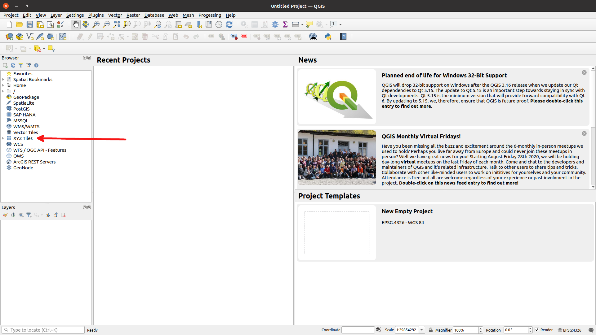

On the far left hand side, you see an item called '``XYZ Tiles``'.
Click on the down-arrow to the left of '``XYZ Tiles``'
and the '``OpenStreetMap``' label will appear. Double-click on '``OpenStreetMap``'.
Your screen should now look like this:

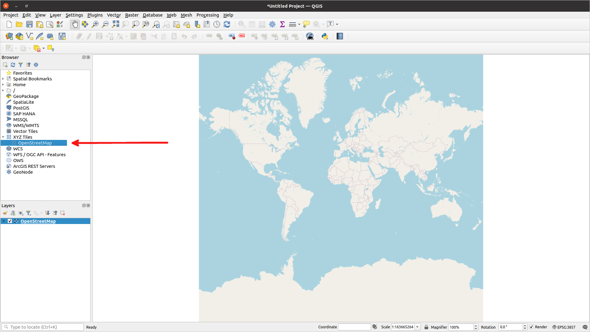

At the very top of the screen select '``Layer``', then '``Add Layer``', and then
'``Add Raster Layer...``'. You will then get a pop-up window that looks like:

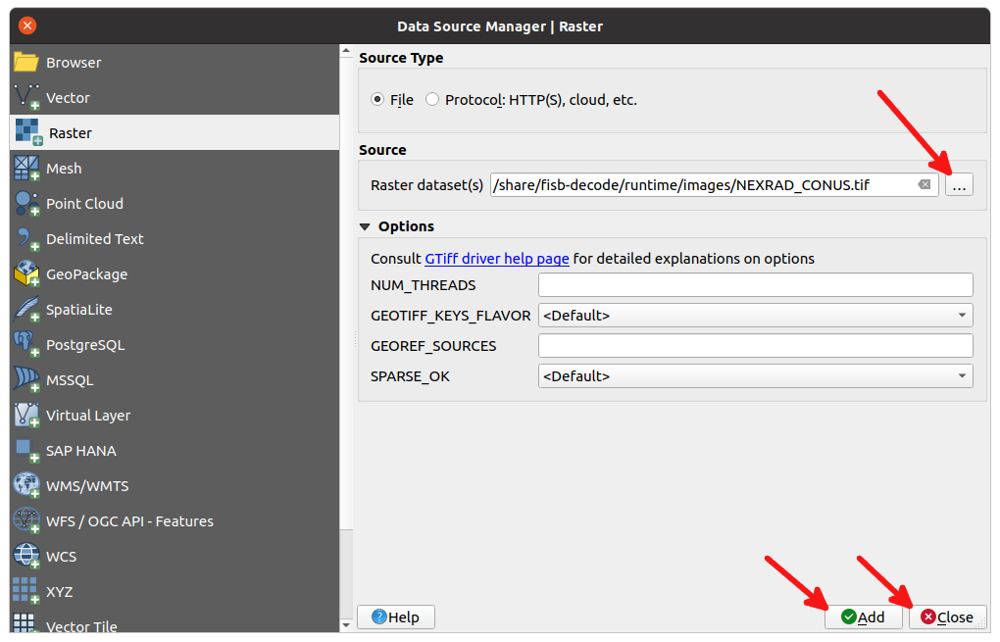

Under '``Source``' and to the
right of '``Raster dataset(s)``' click the 3 dots '``...``' to bring
up a file dialog. Find an image file in the ``fisb-decode/runtime/images``
directory. In this example I chose ``NEXRAD_CONUS.png``. Click the ``Open`` button
on the top right of the file dialog and you will be returned back to the raster
dialog box. Click '``Add``' in the bottom right corner (your selected filename should
be in the box to the right of the '``Raster dataset(s)``' line)
and then click '``Close``'. Your screen will
now look something like:

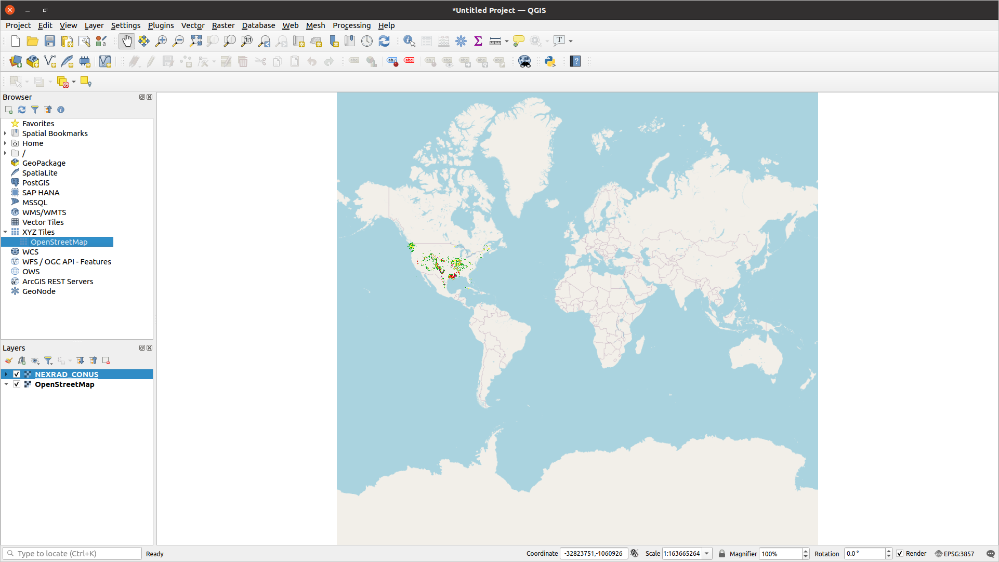

Use your mouse scroll wheel to zoom in and out. Hold the left mouse button to
pan. You should be able to make your screen similar to:

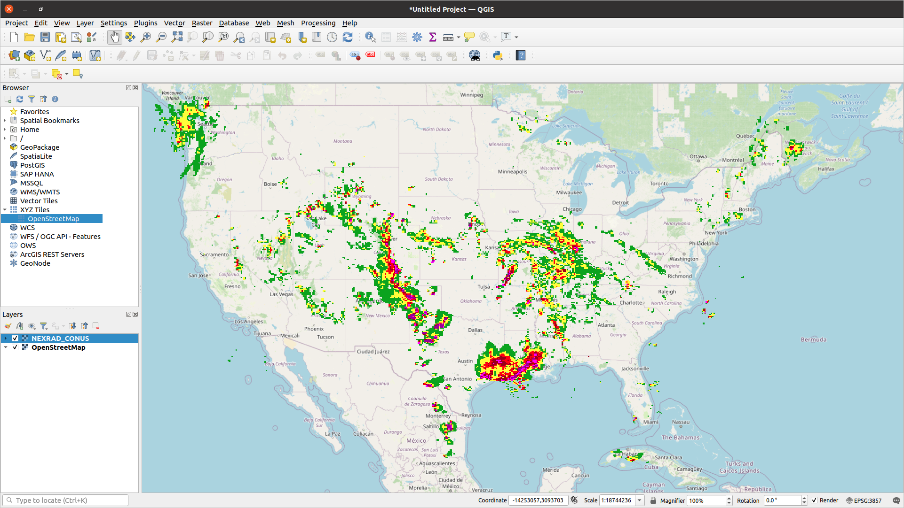

That's pretty much it for loading ``.png`` files. Your most important box at this
point is the ``Layers`` area at the bottom left. Right clicking on a layer will
give you a number of useful options. Click the check mark next to the layer name
to make the layer visible or invisible.

Viewing Vectors
---------------

Lots of messages in FIS-B generate vector data. AIRMETS, SIGMETS, WST, CWA,
NOTAMS, etc. Text weather data (METAR, TAF, etc) as well as PIREPs do too if
you have the location support up and running. Vector data comes in the form
of points, polygons, and linestrings. FIS-B also has circles, but harvest already
turned any circles into 32 point polygons.

To get started with vectors, we will take a 'vector snapshot'. From the
``bin`` directory type: ::

  ./vectordump

If you have any vector data, your ``bin`` directory will suddenly have lots of
``.csv`` files it. Like so: ::

  mbarnes@gis:/share/fisb-decode/bin$ ls
  config-files-bckup decode-nopp        trickle                  V-NOTAM-D-PT.csv
  config-files-rstr  harvest            trickleToDir             V-NOTAM-FDC-PT.csv
  decode             isodate-from-secs  V-AIRMET-PG.csv          V-PIREP-PT.csv
  decode0            isodate-to-secs    vectordump               V-TAF-PT.csv
  decode0Net         localwx            V-G_AIRMET_00_HR-LS.csv  V-WINDS_06_HR-PT.csv
  decode1            locationdb         V-G_AIRMET_00_HR-PG.csv  V-WINDS_12_HR-PT.csv
  decode1Net         loopfiles.sh       V-G_AIRMET_03_HR-LS.csv  V-WINDS_24_HR-PT.csv
  decode2            nopp2pp            V-G_AIRMET_03_HR-PG.csv  V-WST-PG.csv
  decode2Net         pp2nopp            V-G_AIRMET_06_HR-LS.csv  WMM.COF
  decodeNet          run-all-tests      V-G_AIRMET_06_HR-PG.csv
  decodeNetToDir     tgTo978            V-METAR-PT.csv

Ugly huh? Doing a vector dump is something that doesn't happen very often in real
life, so I just put the files in the current directory
(``bin`` in this case) and you should '``rm *.csv``' when you are
done.

The vector files all start with ``V-`` then the item the vector is for.
So ``METAR`` for METARs, etc. If there is no vector information for a particular
type, a file will not be created. In this case, there is no ``NOTAM_TFR`` with
vector data, so there is no file.
The last part is either ``-LS``, ``-PT``, or ``-PG``. These
stand for *linestring*, *point*, and *polygon*, respectively. QGIS requires
that each file only contains data of a single type. G-AIRMETs can contain
both polygons and linestrings, but each type needs to be in a different file.

The files produced are ``.csv`` files and each line is its own object in
something called WKT (Well Known Text) format.

Vectors in QGIS are trickier to display than raster (``.png``) images.
To load a vector file, start up QGIS, double click on '``OpenStreetMap``' just
like you did for raster files. Now select '``Layer``' at the top of the
screen. Select '``Add Layer``' and then '``Add delimited text layer...``'.
You should now have a screen that looks like:

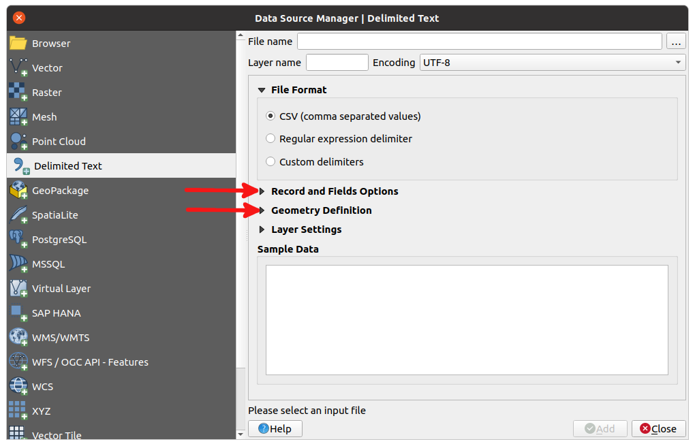

The screen you will initially see has the '``Record and Fields Options``' and
'``Geometry Definition``' sections collapsed. Click of the
arrows to the left of them to expand them. Don't worry about
'``Layer Settings``'.

Unlike the raster screen where we didn't care about anything other than the file
name, on this screen you need to make sure **EVERYTHING** on the screen
below matches. Change the screen as needed.
In particular make sure that:

* In '``File Format``', select '``Custom delimiters``'. Make sure '``Tab``' is
  selected.
* For '``Record and Fields Options``', **unselect** '``First record has field names``'.
* Number of header lines to discard is '``0``'.
* Geometry Definition has '``Well known text``' selected and
  '``Geometry CRS``' is '``Default CRS: EPSG:4326 - WGS 84``' (you will need
  to click the drop down arrow to find this option).
* Geometry type has '``Detect``' selected.
* Don't worry about '``Layer Settings``'.

You only have to do make these changes once.
From here on every time you open up a vector file, the settings will be the last
settings you used.
Your screen should look like:

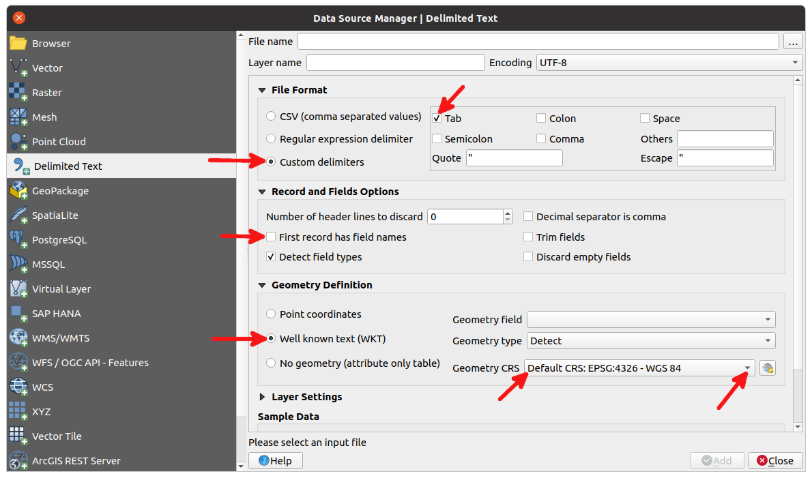

Once you changed the settings, select the filename just like you did with
a raster file. Click the '``...``' for the '``File name``' field. Select the
file, then click on '``Open``' at the top right of the dialog.
Now click on '``Add``', then click on '``Close``'. Now your screen should
resemble:

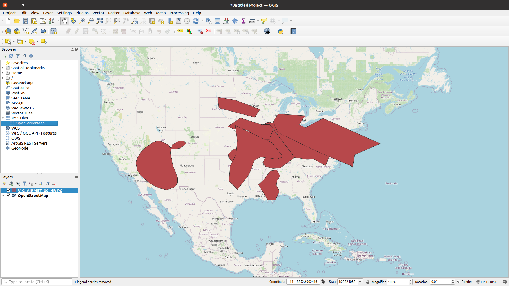

The data is there, but it's just a mass of solid color. Let's change it to an
outline form. First, bring up the '``Layer Styling``' panel.
In the top menu bar select '``View``' then '``Panels``' then click the
check-mark next to '``Layer Styling``'. The panel will appear on the right
side of the screen, but is not wide enough. Grab the left hand margin of the
panel and extend it a bunch. It should look like:

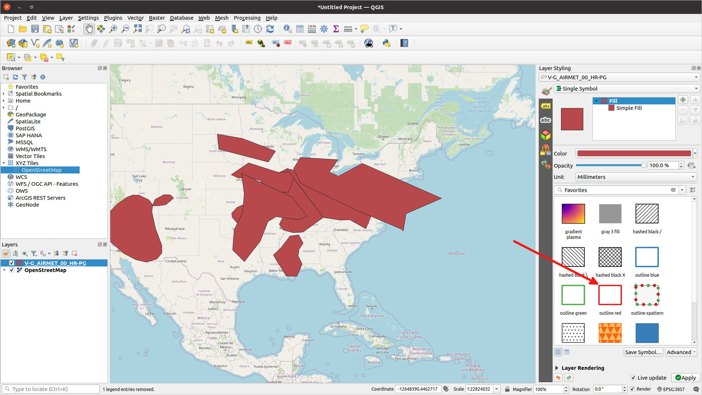

Your attention from here on out is on the '``Layer Styling``' panel.
You should see a bunch of rectangles. Click on the one with the
red border called '``outline red``'
('``outline green``' or '``outline blue``' works
just as well). Now your screen should approximate:

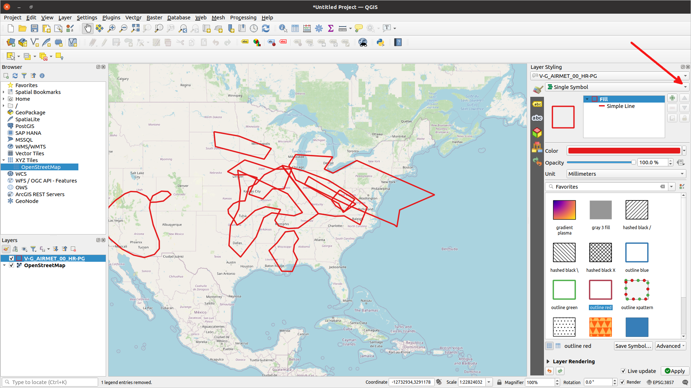

Well, we have outlines, but that didn't make things any clearer.
Next let's make each outline a different color.
Near the top right side is a drop-down box that has '``Single Symbol``' as its default.
Click the arrow on the right side of the box and select '``Categorized``'. Once
you do that, your vectors will disappear. Don't fret. Right underneath
the '``Categorized``' drop-down is another one labeled '``Value``'. Click on its
arrow and select '``abc field_1``'. Then, a little bit further down the right
side of the screen is a button labeled '``Classify``'. Click on it. Voila!
Your vectors are back, each in a different color. It should resemble:

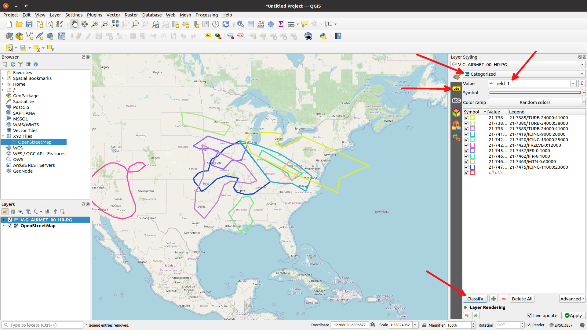

Last step is to add some labels. On the left side of the
'``Layer Styling``' panel,
you will see some icons. There
are two that say '``abc``'. You want the yellow top one, not the white one.
Click on it. There should now be a drop-down label that says '``No Labels``'.
Click its drop-down arrow and select '``Single Labels``'. Now you have labels.
But they are not in the best place. You should see menu of icons underneath
where
it says '``Value``' with the contents '``abc field_1``'.
Select the 8th icon over that is 4 green arrows pointing N, S, E, W.
You should see the '``Placement``' screen. Underneath that is a drop down box
labeled '``Mode``', with its value '``Around Centroid``'. Select its drop-down arrow
and select '``Using Perimeter``'. There are no great label
placement settings, but that's usually the best. Zooming in will usually help.

Don't worry too much about what the label says, it's meant for debugging, not
general interpretation.

Your screen should mimic:

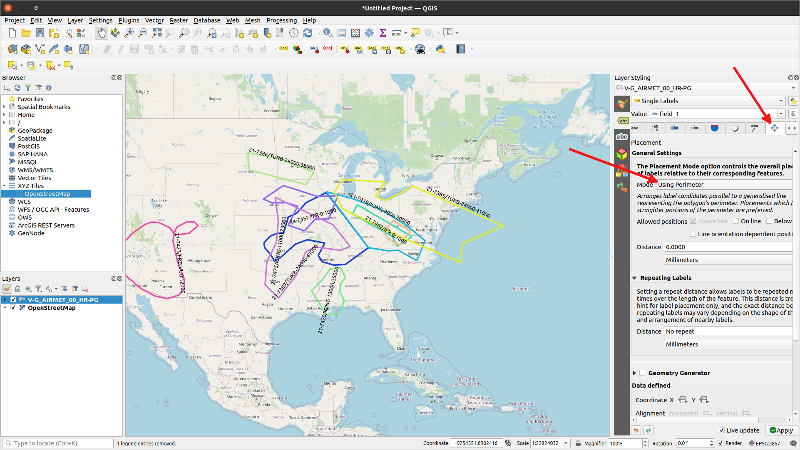

Okay, you can now load vectors into QGIS. Congrats!
Try other files, such as files with linestrings (G-AIRMET) or points (NOTAM,
METAR, etc).

If you ever want to save an image of a map, you can select '``Project``'
from the menu at the top of the screen. Then '``Import/Export``' followed by
'``Export Map to Image...``'. You can make some image adjustments, but usually
I just click on '``Save``'. Then you can select the file format and where to save
it. I added the linestring G-AIRMET that accompanied the polygon G-AIRMET
and did all the steps we did above to get
the following image:

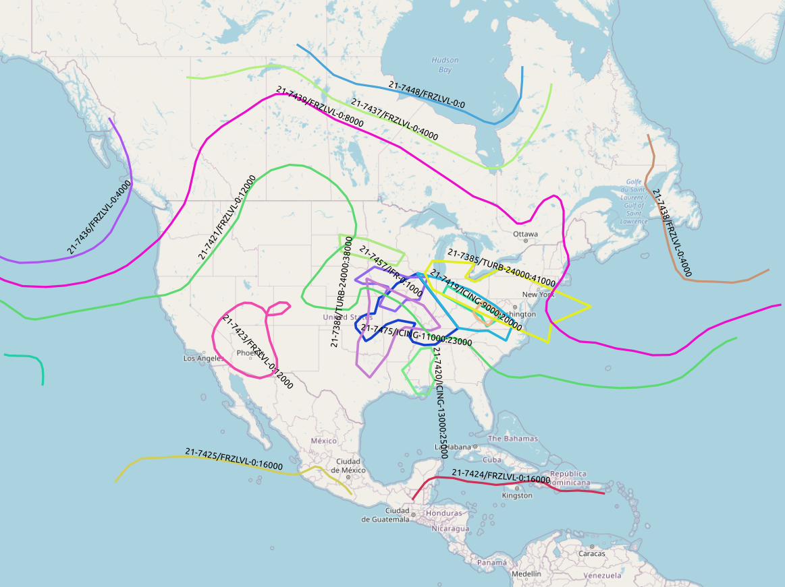

.. _Running Test Groups 28-30:

Running Test Groups 28-30
-------------------------

A '*Test Group*' is a set of FIS-B packets that are played back in real time
to test various behaviors of the system. As of now, there are 30 test groups.
27 (01-27) of these come from the standard body and 3 (28-30) were created by me.
We will be start the discussion about how they work and how to process them
with the ones I created. We will discuss the ones from the standard body later.

The basic process is you start harvest with
the option ``--test n`` where '``n``' 
is the number
of the test to run. Harvest starts up a sub-process that runs the program
'``trickle``'.
Trickle will fetch the correct set of FIS-B messages from a ``.978`` file and
starts placing them in the same directory where harvest normally finds its files.

When trickle starts, it looks at the timestamp of the first message. It then
calculates the difference between that timestamp and the current timestamp.
That value is placed in the file ``sync.fisb`` which is read by harvest.
Harvest then adjusts its time so that anytime the current time is needed, harvest
will use the time relative to the message. It's just like a time machine.

Trickle will 'trickle' the packets out at a rate that equals the rate
that they arrived originally.
If, at the time the packets were captured, one packet was received 3 seconds after
the first, trickle will also wait 3 seconds before sending the next packet.

If you are a really astute system watcher, you will note that after trickle has
finished reading packets, but before harvest does its last dump, the trickle process
will become a 'zombie' process. Don't worry about this. When harvest finishes, or
is terminated, the zombie process will go away. For many tests that wait around before
making a final check, this might be an hour or more.

The ``.978`` files with the FIS-B packets are stored in the
``fisb-decode/tg/tg-source/generated/`` directory. The filename with packets is just
the name of the test group with a ``.978`` extension. So test group 28's
filename is ``tg28.978``.

Another concept to understand with test groups is that of a '*trigger*'.
A trigger is some point in time during the test run where we need to dump
the contents of the system so that we can examine it later. This dump
will happen in a
specifically named empty directory and will be filled with a dump of all database
tables, vectors, images, and anything else to create a snapshot of the system
at the time of the trigger. After the run you can go back and make sure the
results were what you expected.

Triggers are stored in the directory ``fisb-decode/tg/triggers``.
Trigger files have the same name as the test group, but are ``.csv`` files.
They typically have one to ten lines.
The trigger for test group 28 (``tg28.csv``) contains: ::

  72393, 0, 1, Verify DAYTON TFR (10 and 30 nm circles)

``72393`` tells harvest to
produce a trigger dump at 72393 seconds after midnight on the day it
was started. ``0`` is an offset. You will see numbers like ``30`` or ``-30``
here. This means to add 30 or subtract 30 seconds from the trigger time of
72393 before actually doing the trigger. We do this because instructions
for many of the test groups say things like 'check for this before 72393
seconds and then check for that after 72393 seconds'. This lets us keep
using the time in the instructions, but modify times slightly to
accomplish the tasks. The ``1`` is just a sequence number. This is used
to create the correct dump sub-directory. We will get to that in a moment.
The string field at the end is just a message that is printed when the
dump happens.

Triggers for standard body test groups are the same as above, but the
comment line start with a number (or numbers) in square brackets, like
``[5]`` or ``[7-9]``. These indicate the items number(s) in the documentation
the trigger applies to.

You will also note another file in the trigger directory called
``start-dates.csv``. It has one line for each test group which contains
the name of the test group and the date the test is considered to have been
started. These dates are used to calculate the seconds after midnight referred
to in the test instructions. You may ask: 'If the FIS-B packets already have
a timestamp in them, why do we need a specific start date?' And the answer is that
you don't need them for non-standard body test groups (28-30). But the standard
body test groups usually don't specify a start date, so I had to figure one
out for each test.

To run test 28, from the ``bin`` directory type: ::

  ./harvest --test 28

Your output should look like: ::

  *** Running Test 28 ***
  Waiting for sync.fisb to be created by trickle.
  Expect trigger events at:
    01: 2021-05-17 02:44:54-04:00  72393 -> 2020-09-18 20:06:33

  (time delay here)
  
  01:  Verify DAYTON TFR (10 and 30 nm circles)
  ** done **

Harvest tells you at the start of the run when to expect trigger events in
your actual local clock time. In this case it is telling me it will produce a
dump at ``2021-05-17 02:44:54-04:00`` local time.
Since there is only one trigger, the
program will stop then too. ``72393`` is the number of seconds past midnight
on ``2020-09-18`` and ``2020-09-18 20:06:33`` is the UTC time in the past
that corresponds to ``72393`` seconds past midnight on that date.
When the trigger actually happens, it prints its associated message.

Trigger dumps are placed in the ``fisb-decode/tg/results`` folder. It will
create a new directory with the name of the test group, then sub-folders
under that with the sequence number of the trigger (``01``, ``02``, etc).
So in our case, when the test is done, it will have created the folder:
``fisb-decode/tg/results/tg28/01``. Its directory contents will be: ::

  2020-09-18-200633_72393  NOTAM_TFR.db  V-NOTAM-TFR-PG.csv

Every dump file will have a file with a name
like ``2020-09-18-200633_72393``. It just tells you the time in UTC (in the
past) that the message was processed. ``2020-09-18-200633`` means
'2020-09-18 20:06:33'. ``72393`` is as discussed previously. The contents
of this file will be the text of the trigger.

For some test groups, the offset is varied either slightly ahead or behind the
specified trigger time. This handles cases like 'check before this time', or
'check after this time'. The trigger filename will then look like one of: ::

  2020-09-18-200633_72393~72398-5
  2020-09-18-200633_72393~72390+3

The value after the tilde is the time as noted in the documentation, followed
by a positive or negative offset. This is helpful, since when you are following
along with a test, it's most useful to reference the number in the documentation.

``NOTAM_TFR.db`` is an augmented dump of the Mongo ``NOTAM_TFR`` table. Some tables
that have ``start_time`` and ``stop_time`` fields have an added ``status``
field to tell you if the the message is ``active``, ``pending activation``,
or ``expired``. This is based on the current time of the dump. Since this
isn't normally part of the database record, we add it at the time of the
dump. CRL messages will also have a ``status`` field added to tell you if the
CRL is ``complete`` or ``incomplete``.

``V-NOTAM-TFR-PG.csv`` contains the vector information for the TFR.
When displayed in QGIS it will look like:

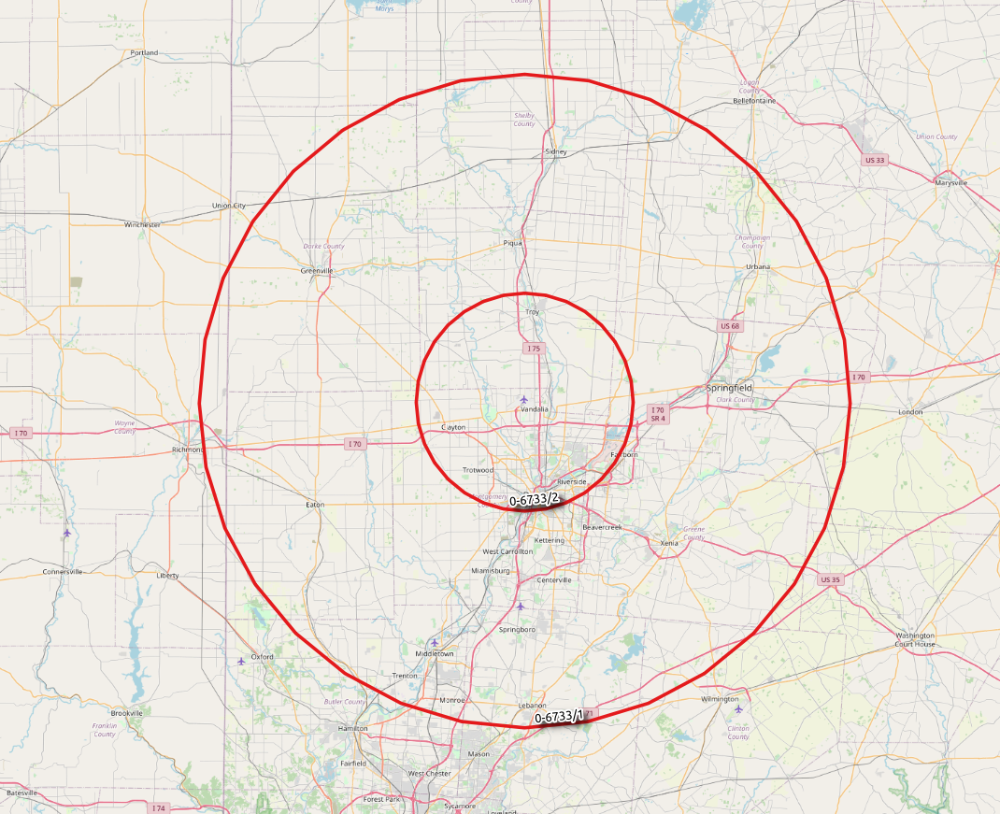

Test group 29 is another example of a TFR. Its vector data will look like
this in QGIS:

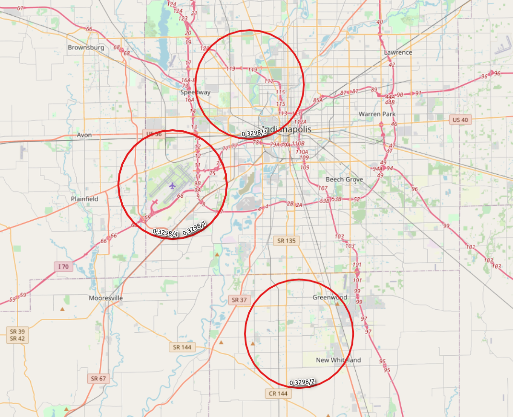

Test group 30 is a more realistic scenario. It is about 8 minutes of live data.
It is the only actual example I have ever found of a CRL overflowing. A CRL
can handle 138 entries before it declares overflow. An overflowed CRL can't
be declared complete even if all its reports are complete, because there are
more unreported reports.

The directory ``fisb-decode/tg/results/tg30/01`` contains
(it will also contain a file with the extension ``.png.aux.xml``
for each ``.png`` file): ::

  2020-10-30-0900277  ICING_10000_SEV.png image-report.txt     TURBULENCE_22000.png
  CLOUD_TOPS.png      ICING_10000_SLD.png LIGHTNING_ALL.png    TURBULENCE_24000.png
  CRL_11.db           ICING_12000_PRB.png LIGHTNING_POS.png    V-AIRMET-PG.csv
  CRL_12.db           ICING_12000_SEV.png METAR.db             V-G_AIRMET_00_HR-LS.csv
  CRL_14.db           ICING_12000_SLD.png NEXRAD_CONUS.png     V-G_AIRMET_00_HR-PG.csv
  CRL_15.db           ICING_14000_PRB.png NEXRAD_REGIONAL.png  V-G_AIRMET_03_HR-LS.csv
  CRL_16.db           ICING_14000_SEV.png NOTAM.db             V-G_AIRMET_03_HR-PG.csv
  CRL_17.db           ICING_14000_SLD.png NOTAM_TFR.db         V-G_AIRMET_06_HR-LS.csv
  CRL_8.db            ICING_16000_PRB.png PIREP.db             V-G_AIRMET_06_HR-PG.csv
  G_AIRMET.db         ICING_16000_SEV.png RSR.db               V-METAR-PT.csv
  ICING_02000_PRB.png ICING_16000_SLD.png SERVICE_STATUS.db    V-NOTAM-D-PT.csv
  ICING_02000_SEV.png ICING_18000_PRB.png SIGWX.db             V-NOTAM-FDC-PT.csv
  ICING_02000_SLD.png ICING_18000_SEV.png TAF.db               V-PIREP-PT.csv
  ICING_04000_PRB.png ICING_18000_SLD.png TURBULENCE_02000.png V-TAF-PT.csv
  ICING_04000_SEV.png ICING_20000_PRB.png TURBULENCE_04000.png V-WINDS_06_HR-PT.csv
  ICING_04000_SLD.png ICING_20000_SEV.png TURBULENCE_06000.png V-WINDS_12_HR-PT.csv
  ICING_06000_PRB.png ICING_20000_SLD.png TURBULENCE_08000.png V-WINDS_24_HR-PT.csv
  ICING_06000_SEV.png ICING_22000_PRB.png TURBULENCE_10000.png V-WST-PG.csv
  ICING_06000_SLD.png ICING_22000_SEV.png TURBULENCE_12000.png WINDS_06_HR.db
  ICING_08000_PRB.png ICING_22000_SLD.png TURBULENCE_14000.png WINDS_12_HR.db
  ICING_08000_SEV.png ICING_24000_PRB.png TURBULENCE_16000.png WINDS_24_HR.db
  ICING_08000_SLD.png ICING_24000_SEV.png TURBULENCE_18000.png
  ICING_10000_PRB.png ICING_24000_SLD.png TURBULENCE_20000.png

This is pretty representative of what you find in a test group dump. In our case,
we would need to look at ``CRL_14.db`` and verify that the overflow is set.

If you don't have access to any data at all and just want to see what things
look like, test group 30 is is a good example because it has about 'one of everything'.

One file we haven't covered is ``image-report.txt``. Its contents will be similar
to: ::

  Current Image Report at 2020/10/30 09:00:27

  NEXRAD_REGIONAL
    observation_time: 2020/10/30 08:58:00
    newest_data: 2020/10/30 08:58:00
    image age (mm:ss): 02:27
    last_changed: 2020/10/30 09:00:16
  NEXRAD_CONUS
    observation_time: 2020/10/30 08:54:00
    newest_data: 2020/10/30 08:54:00
    image age (mm:ss): 06:27
    last_changed: 2020/10/30 08:56:41
  CLOUD_TOPS
    valid_time: 2020/10/30 09:00:00
    image age (mm:ss): 00:27
    last_changed: 2020/10/30 08:58:51
  LIGHTNING
    observation_time: 2020/10/30 08:55:00
    newest_data: 2020/10/30 08:55:00
    image age (mm:ss): 05:27
    last_changed: 2020/10/30 08:55:33
  ICING_02000
    valid_time: 2020/10/30 08:00:00
    image age (mm:ss): 60:27
    last_changed: 2020/10/30 08:57:43
  ICING_04000
    valid_time: 2020/10/30 08:00:00
    image age (mm:ss): 60:27
    last_changed: 2020/10/30 08:58:05

    (removed more ICING products)

  TURBULENCE_02000
    valid_time: 2020/10/30 09:00:00
    image age (mm:ss): 00:27
    last_changed: 2020/10/30 08:57:14
  TURBULENCE_04000
    valid_time: 2020/10/30 09:00:00
    image age (mm:ss): 00:27
    last_changed: 2020/10/30 08:57:34

    (removed more TURBULENCE products)

Because ``.png`` files don't have obvious metadata, this file contains
various image statistics at the time of the dump. Radar and lightning
data can have multiple sources for an image, but the age from the oldest
to the newest data can't be more than 10 minutes.

One other report not covered yet is ``SERVICE_STATUS``. Service status
is a report that shows what planes are being provided TIS-B services. This
is the hockey puck shaped area around a plane that TIS-B is providing UAT
data for. In our example, it looks like: ::

  {'_id': '40.0383~-86.255593',
   'expiration_time': '2020-10-30T09:00:54+00:00',
   'traffic': ['aaf8ba', 'ac89af']}

Service status is provided by each ground station. So there will be one
record for each station you are receiving. The ``_id`` value is the
id of the station (a concatenation of its longitude and latitude).
These messages are sent frequently, so are expired
quickly (40 seconds).
``traffic`` is a list of ICAO numbers for each plane being followed.
If there are no planes being followed, no service station packets will be
created. When there are a lot of planes being followed, FIS-B will send out
messages that do not list all planes, but rather a subset. Harvest keeps
a list of all planes, and this message will report all current planes.

Backing Up and Restoring Config Files
-------------------------------------

Running the test groups from the standard body requires many configuration
file changes. Provided are a couple of simple scripts for backing up and
restoring all your config files. These are simple ``tar`` scripts and will work
fine on most Linux systems. They provide a simple method for switching
between various configurations.

From the ``bin`` directory, to backup or restore your configuration files type: ::

  ./config-files-backup <filename to store compressed tar file>
  ./config-files-restore <compressed tar file to restore from>

For example, to save the config files into my home directory I might type: ::

  ./config-files-backup ~/STABLE-051721.tgz

It is better to provide a full path for both of these commands.
If instead, I had typed: ::

  ./config-files-backup STABLE-051721.tgz

The file would have placed in the ``..`` directory, or
``fisb-decode``.

To restore the config files (**wiping out**
any existing config files (be careful here))
I would type (also from the ``bin`` directory): ::

  .config-files-restore ~/STABLE-051721.tgz

I would highly suggest backing up your config files before trying to run
the test groups from the standard body. We will be making large changes
to the config files.

Running Test Groups 01-27
-------------------------

On to the final frontier! The standard body provides a set of 27 test groups
which you can get from their web site. The basic process is to go to the store
section, make an account, find the latest set (DO-358B currently), put them
in your cart, and "purchase" them (as of now, they are free). You get a link
and can download them. They come as a zip file.

The zip file you will get is definitely not friendly to Linux.
The normal ``zip`` tools didn't work for me. You will need to use the ``7zz``
program from
`7-ZIP <https://www.7-zip.org>`_.
Linux downloads can be `found here <https://www.7-zip.org/download.html>`_.

**7zz will be happier if you rename (or make a copy of) the file you downloaded
to a new filename without any spaces in the name.**. Do this before running the following
procedure.
From the ``bin`` directory (and assuming a Linux system that has ``7zz``
installed (and you removed spaces from the filename)), you can run: ::

  ./install-imported-tg <your tg-file without spaces>

As a check, each ``TGnn`` directory
in ``fisb-decode/tg/tg-source/imported`` should have at least one ``.csv``
file, a ``bin`` directory whose contents are ``<number>.bin`` files (all
432 characters in length), and a ``.pdf`` file. Before performing a test,
you will want to read the ``.pdf`` file.

The next step is to take all this and turn it into a form fisb-decode can
use.

Change your directory back to ``bin`` (i.e. ``fisb-decode/bin``) and type: ::

  ./tgTo978

After a few seconds or so it will complete and it will have created
new ``.978`` files in ``fisb-decode/tg/tg-source/generated``.

One of the test groups has some serious issues with it and needs to
be patched. From the ``bin`` directory type: ::

  patch ../tg/tg-source/generated/tg13.978 -i ../misc/tg13.patch
  
Now you are ready to run the tests. Well, almost.

We will now be making some pronounced changes to the configuration files.
Up to this point, we have been gradually adding features to 'fisb' and
'harvest'. Now we do the opposite, and remove all the advanced features.
I highly suggest you look at the previous section and do a backup of the
config files. The configuration for testing is only really used for testing,
so once you make all the changes, you probably want to make a backup of the
testing configuration. You might be switching back and forth occasionally between a
normal config and a test config, so having backups of both sets is a good idea.

What follows are changes to the config files for testing (referenced
to the ``bin`` directory). Items not listed
don't need to be changed.

``../fisb/level0/level0Config.py`` ::

  SKIP_EMPTY_FRAMES = True
  DETAILED_MESSAGES = False
  BLOCK_SUA_MESSAGES = True
  ALLOW_SERVICE_STATUS = False
  ARCHIVE_MESSAGES = False
  WRITE_MESSAGE_TO_FILE = False
  SHOW_MESSAGE_SOURCE = False
  CALCULATE_RSR = True
  RSR_CALCULATE_EVERY_X_SECS = 1
  RSR_CALCULATE_OVER_X_SECS = 10
  RSR_USE_EXPECTED_PACKET_COUNT = False
  MONGO_URI = 'mongodb://localhost:27017/' ( *set for your system* )
  DLAC_4BIT_HACK = True
  GENERATED_TEST_DIR = '../tg/tg-source/generated'
  ALLOW_DECODE_TEST = True
  
``../fisb/level1/level1Config.py`` ::

  SEGMENT_EXPIRE_TIME = 60
  TWGO_EXPIRE_TIME = 720  # 12 Hours
  EXPUNGE_CHECK_MINUTES = 30
  READ_MESSAGES_FROM_FILE = False

``../fisb/level2/level2Config.py`` ::

  METAR_EXPIRATION_MINUTES = 120
  FISB_EXPIRATION_MINUTES = 20
  PIREP_EXPIRATION_MINUTES = 76
  PIREP_USE_REPORT_TIME_TO_EXPIRE = False
  TWGO_DEFAULT_EXPIRATION_TIME = 61
  BYPASS_TWGO_SMART_EXPIRATION = True
  
``../fisb/level3/level3Config.py`` ::

  PIREP_STORE_LEVEL3 = False
  PRINT_TO_STDOUT = False
  WRITE_TO_FILE = True
  OUTPUT_DIRECTORY = "../runtime/harvest"

``../fisb/trickle/trickleConfig.py`` ::

  INITIAL_DELAY = 10
  SYNC_DIRECTORY = '../runtime/misc'

``../db/harvest/harvestConfig.py`` ::

  HARVEST_DIRECTORY = '../runtime/harvest'
  MAINT_TASKS_INTERVAL_SECS = 10
  MONGO_URI = 'mongodb://localhost:27017/' ( *set for your system* )
  EXPIRE_MESSAGES = True
  ANNOTATE_CRL_REPORTS = True
  PROCESS_IMAGES = True
  IMAGE_DIRECTORY = '../runtime/images'
  SYNC_FILE = '../runtime/misc/sync.fisb'
  TG_START_DATES = '../tg/triggers/start-dates.csv'
  TG_TRIGGER_DIR = '../tg/triggers'
  TG_DIR = '../tg'
  IMMEDIATE_CRL_UPDATE = True
  IMAGE_QUIET_SECONDS = 0
  PRINT_IMMEDIATE_EXPIRATIONS = False
  TEXT_WX_LOCATION_SUPPORT = False
  PIREP_LOCATION_SUPPORT = False
  SUA_LOCATION_SUPPORT = False
  SAVE_UNMATCHED_PIREPS = False
  NOT_INCLUDED_RED = 0xEC
  NOT_INCLUDED_GREEN = 0xDA
  NOT_INCLUDED_BLUE = 0x96
  IMAGE_MAP_CONFIGURATION = 1
  CLOUDTOP_MAP = 0
  RADAR_MAP = 0

You are now ready to run the tests. Running all the tests will take a little
under 26 hours. Most of the process is like watching paint dry. The tests have to
wait to make sure that certain data is still there after a certain length
of time, or maybe the data needs to be deleted. Lots of waiting. Running
the test is exactly like for you did for tests 28 through 30. To run test 1
type (from ``bin``): ::

  ./harvest --test 1

When you start a test it will tell you how many dumps will be done,
and at what time they will occur (both in your local time and in message
time). The last dump is always the time the test will complete.

Be sure to read the ``.pdf`` file that comes with each test. It will tell you
what the test should do and the output to expect. The tests are based on end
user experiences, and 'fisb-decode' is a back-end system, so none of the
'experience' parts (i.e. updating screen with image age, image legends, etc)
will apply.

You can run all the tests at once by typing: ::

  ./run-all-tests

Then take a break for 26 hours. If there are any errors detected when running
this command the error files will be placed in the ``../tg/results/tg<nn>``
folder, where ``<nn>`` is the number of the test. ``tg15`` is the only test
where an error is expected and normal.

Debugging Test Groups with ``./decode-test``
--------------------------------------------
Sometimes debugging test groups can be difficult.
There is a set of scripts which will take the messages
from a test group and add comments to the messages, showing
the timestamp when they were received and when any dump was
done. Before using these commands you need to make a
change in ``fisb-decode/fisb/level0/level0Config.py``.
Make sure you have already installed all the harvest
dependencies previously, and set the ``ALLOW_DECODE_TEST``
parameter as follows: ::

  ALLOW_DECODE_TEST = True

The general format is: ::

  ./decode-test <test number>

``decode-test`` is the output from 'fisb' level 3. There is also
``decode0-test``, ``decode1-test`` and ``decode2-test`` that will
use the other 'fisb' levels.

Output from test group 28 (which is basically 4 segmented messages)
looks like: ::

  ./decode-test 28
  #-----------------------------------------------------------
  # PACKET: 2020-09-18T20:05:32.128Z
  #
  #-----------------------------------------------------------
  # PACKET: 2020-09-18T20:05:32.174Z
  #
  #-----------------------------------------------------------
  # PACKET: 2020-09-18T20:05:32.247Z
  #
  #-----------------------------------------------------------
  # PACKET: 2020-09-18T20:05:33.046Z
  #
  {
    "type": "NOTAM_TFR",
    "unique_name": "0-6733",
    "contents": "NOTAM-TFR 0/6733 211945Z PART 1 OF 6 OH..AIRSPACE
     DAYTON, OHIO..TEMPORARY FLIGHT RESTRICTIONS. SEPTEMBER 21, 2020
     LOCAL. PURSUANT TO 49 USC 40103(B)(3), THE FEDERAL AVIATION
     ADMINISTRATION (FAA) CLASSIFIES THE AIRSPACE DEFINED IN THIS
     NOTAM AS 'NATIONAL DEFENSE AIRSPACE'. PILOTS WHO DO NOT ADHERE
     TO THE FOLLOWING PROCEDURES MAY BE INTERCEPTED, DETAINED AND
                       <lines deleted>
     ZID PART 2 OF 6 OH..AIRSPACE DAYTON, OHIO..TEMPORARY FLIGHT
     REGULATIONS, AIRCRAFT FLIGHT OPERATIONS ARE PROHIBITED WITHIN AN
     AREA DEFINED AS 30 NM RADIUS OF 395408N0841310W (DQN131010.7)
     SFC-17999FT MSL EFFECTIVE 2009211945 UTC (1545 LOCAL 09/21/20)
     UNTIL 2009220000 UTC (2000 LOCAL 09/21/20). WITHIN AN AREA
     DEFINED AS 10 NM RADIUS OF 395408N0841310W (DQ(INCMPL)",
    "station": "40.0383~-86.255593",
    "number": "0/6733",
    "start_of_activity_time": "2020-09-21T19:45:00Z",
    "end_of_validity_time": "2020-09-22T00:00:00Z",
    "geometry": [
      {
        "type": "CIRCLE",
        "altitudes": [
          18000,
          "MSL",
          0,
          "MSL"
        ],
        "start_time": "2020-09-21T19:45:00Z",
        "stop_time": "2020-09-22T00:00:00Z",
        "element": "TFR",
        "coordinates": [
          -84.218445,
          39.90097
        ],
        "radius_nm": 30.0
      },
      {
        "type": "CIRCLE",
        "altitudes": [
          18000,
          "MSL",
          0,
          "MSL"
        ],
        "start_time": "2020-09-21T19:45:00Z",
        "stop_time": "2020-09-22T00:00:00Z",
        "element": "TFR",
        "coordinates": [
          -84.218445,
          39.90097
        ],
        "radius_nm": 10.0
      }
    ],
    "expiration_time": "2020-09-22T00:00:00Z"
  }
  #===========================================================
  # TRIGGER (1): 2020-09-18T20:06:33.000Z (72393)
  # Verify DAYTON TFR (10 and 30 nm circles)
  #

In the example, the first three packets appear blank because they
are segmented messages. If you wanted to view them you could use
``./decode0-test 28``.

The concept behind ``decode-test`` is that you can generate a
'screenplay' of the event and follow along. It won't tell you if
harvest is doing anything wrong, but you can see all the data clearly
and when it arrived. It is usually best to save the output from
``decode-test`` in a file and search for the items you have questions
about. The square brackets at the beginning of trigger comment lines
will refer you to the item number in the documentation that the
trigger refers to.

Notes about Individual Tests
----------------------------

When running test groups from the standard body, it is important
to read its associated ``.pdf`` file. Unfortunately, some are
easier to understand than others. All of the times in the test
groups have an associated trigger time in a trigger file.
Triggers are not part of the standard test groups and were
created by me. They are found in ``fisb-decode/tg/triggers``. To
check if the test completed properly, you need to look at its
documentation and match the times against the trigger.
The documentation is not always written in a logical order.
There are times where something requiring trigger 2 is described
long after other later trigger have been described.

Most tests do not need any clarification. Here are ones that do:

**TG13**

  Worst. Test. Ever. There is a patch that needs to be applied
  before running this test (see instructions above).
  This test uses 'fantasy' TFR-NOTAMs, SIGMETs,
  and AIRMETs that do not in any way resemble what the FAA would send.
  So, if your system, like 'fisb-decode', checks for sane data,
  this test fails out of the gate. The patch will make the feeble
  attempts at data passable. The instructions are confusing--
  the pictures make it look like the graphics appear in a sequential
  fashion. In reality, the graphics pretty much happen
  all at once. All other
  test groups, except this one, will stop sending packets and then have a final
  check. Nope. There are two minutes of useless packets after the
  final check. For no purpose.

**TG15**

  You will get a ``LEVEL0.ERR`` file. That's actually the whole purpose
  of the test-- to catch bogus data.

**TG19**

  With ``BYPASS_TWGO_SMART_EXPIRATION`` set to ``True`` (the normal test
  setting), the NOTAM-TFRs
  will persist, even though the contents are expired. This is
  acceptable for the test. In actual use, you would set
  ``BYPASS_TWGO_SMART_EXPIRATION`` to ``False``, and this issue would
  resolve (same applies to **TG20**).

**TG20**

  With ``BYPASS_TWGO_SMART_EXPIRATION`` set to ``True``, at trigger 8,
  various reports which are shown as not present will still be present.
  The status of all of these reports are expired, but since we need to
  keep them around for an hour after the last time they were sent (per the
  standard), the
  message will not have expired (even though the parts are expired).
  This is expected behavior.

**TG25**

  This TG is the 'master class' of all test groups. Extremely well constructed,
  tests lots of concepts not tested in other groups. Tests many
  realistic edge-cases. I understood lots of
  concepts much better after struggling to get this TG working.

Messages stuck in the system
----------------------------

At the ground station I normally use, messages sometimes get 'stuck' in
FIS-B. In my case, there are two WST messages that have been there for
over a year. Usually level 2 will generate an error message if the message
dates make no sense. As of now, there is code to ignore these messages, both
at the message level and at the CRL level. If this becomes a more common
problem, it would be better to create a system to read these from a file
and ignore them.

Automation using systemd
------------------------

Once your system is properly configured, you can automate everything
using ``systemd``. This will start-up fis-b decode and harvest at boot time.
This assumes you are running a Linux system that uses
systemd for scheduling system tasks.

The most important thing is to make sure your fis-b decode and harvest
are properly configured.
Next, determine the non-root username you wish to run under, and the path to
`fis-b decode` on your system. Then, from the ``bin`` directory, type: ::

  ./systemd-create username path-to-fisb-decode

If your account name is ``fred`` and the ``fisb-decode`` directory is located at
``/home/fred/fisb-decode`` you would type: ::

  ./systemd-create fred /home/fred/fisb-decode

This will create a number of files based on prototype files in the ``../misc``
directory. Some of these files are ``.system`` files that will be placed in the
``/etc/systemd/system`` area, and the others are scripts (with the name ending in
``_system``) placed in the same ``bin`` directory
where you ran the command. These will be called by systemd.

There are three sets of ``.system`` and ``_system`` files. They are:

* ``decode-net-to-dir.service`` and ``decode-net-to-dir_service``.
  This runs ``decodeNetToDir``.
* ``harvest.service`` and ``harvest_service``.
  This runs ``harvest``.
* ``fisb-msg-archive.service`` and ``fisb-msg-archive_service``.
  This runs ``decode0Net``. It is used solely if you want to set up a system
  to archive fis-b messages. If you are running ``decode-net-to-dir`` you
  should not run ``fisb-msg-archive`` at the same time. You can configure
  ``decode-net-to-dir`` to archive messages. If you run them both on the same
  account, you will just collect double messages.

To install ``decode-net-to-dir`` and ``harvest`` as services (this will also start them
and make sure they are started at boot), type (from the ``bin`` directory): ::

  sudo cp ../misc/decode-net-to-dir.service /etc/systemd/system
  sudo systemctl enable --now decode-net-to-dir.service
  sudo systemctl status decode-net-to-dir.service

If you are successful, you should get something similar to the following output
from the status request: ::
   
   ● decode-net-to-dir.service - Collect raw fis-b data
     Loaded: loaded (/etc/systemd/system/decode-net-to-dir.service; enabled; vendor preset: enabled)
     Active: active (running) since Fri 2021-08-13 04:15:29 UTC; 4 days ago
   Main PID: 612 (bash)
      Tasks: 10 (limit: 9448)
     Memory: 531.1M
     CGroup: /system.slice/decode-net-to-dir.service
             ├─612 /bin/bash /home/mbarnes/fisb-decode/bin/decode-net-to-dir_service
             ├─638 /bin/bash /home/mbarnes/fisb-decode/bin/decode-net-to-dir_service
             ├─639 python3 ../fisb/levelNet/levelNet.py
             ├─640 python3 ../fisb/level0/level0.py
             ├─641 python3 ../fisb/level1/level1.py
             ├─642 python3 ../fisb/level2/level2.py
             └─643 python3 ../fisb/level3/level3.py --dir ../runtime/harvest

Repeat the steps for harvest: ::

  sudo cp ../misc/harvest.service /etc/systemd/system
  sudo systemctl enable --now harvest.service
  sudo systemctl status harvest.service

If you using ``fisb-msg-archive`` instead, use the steps above but change the
name in the appropriate places.

In general, if you wish to start, stop, or disable (make it not run at boot),
issue to following command (illustrated for ``harvest.service``): ::

  sudo systemctl start harvest.service
  sudo systemctl stop harvest.service
  sudo systemctl disable harvest.service

Using Stratux as a data source
------------------------------

If you have a `Stratux <https://stratux.me>`_ box, you can use it as a
data feed. In the ``bin`` directory there are the scripts
``decodeStratux`` and ``decodeStratusToDir``. They work exactly like
``decodeNet`` and ``decodeNetToDir``. ``decodeStratux`` will dump level 3
messages to the terminal, and ``decodeStratusToDir`` will send them to a
directory for processing by harvest. There are a few things to consider:

* You need to have a somewhat accurate time set. Plus or minus 30 seconds, or even
  a minute, is fine. Stratux may not provide a time (it might if it has a working
  GPS, but GPS is not mandatory, or it might be intermittent). Having a time source
  such as a real time clock, internet source, or even setting the date and time
  by hand, are
  required. 'fisb-decode' has lots of logic to take FAA partial times and make them
  complete times, but it needs a little help from a clock source.

* Always start Stratux first (and let it boot up) before starting ``decodeStratux``.
  Stratux serves as the DHCP provider and ``decodeStratux`` needs to know its
  assigned address, which can't happen until Stratux is running.

* Internally, Stratux uses another version of dump978 to capture FIS-B packets.
  It converts its output to Garmin GDL 90 format, which
  ``decodeStratux`` receives. The data then gets converted back to dump978 format
  for processing. The FIS-B data will have no associated time. 'fisb' level 0
  will use the local clock UTC time as the message received time.

Using a Raspberry Pi
--------------------

A Raspberry Pi in pretty much any configuration will run the 'fisb' code
without any problems. 'Harvest' is database bound, and therefore filesystem dependent.
Using lots of different Pi models, nothing beats a Pi 4 with an external SSD. 4GB
memory is fine for 'harvest' and 'fisb'. I run Ubuntu 20.04 64-bit (needed by
Mongo) with full GNOME window system, including QGIS, and have had no problems.
With a Kingston 240GB A400 SATA drive in an Inateck 2.5 USB 3.0 (UASP support)
enclosure, the system has been rock solid. Such was not the case when running with
SD cards. Speed is not the same as your desktop, but not annoyingly slow either.

Note: Mongo version 5 (or later) is very restricted on the systems it runs. If you have trouble
installing Mongo (usually indicated by non-helpful messages that are actually 'illegal
instruction' errors), try installing a later Mongo 4 version like 4.4.8.

Running 'fisb' and 'harvest' (with MongoDB) does not use very many resources.
On a 4GB Pi, available memory is more than 3GB at all times and system
run times are always under 5%.
